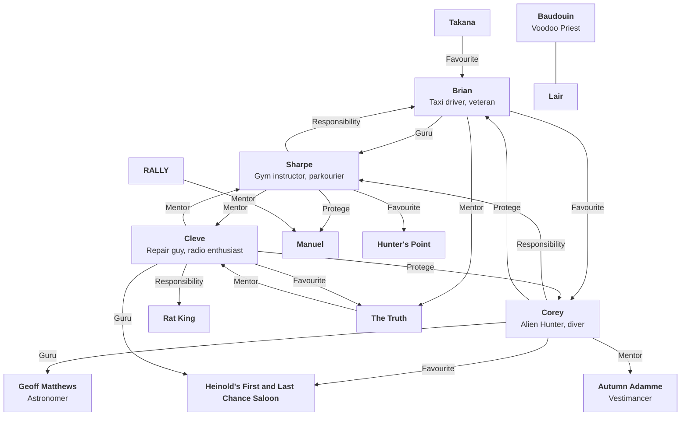

## Unsettling images

```mermaid
%%{init: {'theme':'synthwave'}}}%%
graph TD 
Brian[<B>Brian</B><BR />Taxi driver, veteran];
Cleve[<B>Cleve</B><BR />Repair guy, radio enthusiast]
Corey[<B>Corey</B><BR />Alien Hunter, diver]
Sharpe[<B>Sharpe</B><BR />Gym instructor, parkourier]
Autumn[<B>Autumn Adamme</B><BR />Vestimancer];
Geoff[<B>Geoff Matthews</B><BR />Astronomer]
Heinolds[<B>Heinold's First and Last Chance Saloon</B>];
Lair[<B>Lair</B>];
Manuel[<B>Manuel</B>];
RALLY[<B>RALLY</B>];
RatKing[<B>Rat King</B>];
Takana[<B>Takana</B>];
TheTruth[<B>The Truth</B>];
Baudouin[<B>Baudouin</B><BR />Voodoo Priest];
Hunters[<B>Hunter's Point</B>];


Corey --> |Responsibility| Sharpe
Corey --> |Guru| Geoff
Corey --> |Mentor| Autumn
Corey --> |Favourite| Heinolds
Corey --> |Protege| Brian

Brian --> |Guru| Sharpe
Brian --> |Mentor| TheTruth
Brian --> |Favourite| Corey

Cleve --> |Protege| Corey
Cleve --> |Responsibility| RatKing
Cleve --> |Mentor| Sharpe
Cleve --> |Guru| Heinolds
Cleve --> |Favourite| TheTruth

Sharpe --> |Protege| Manuel
Sharpe --> |Mentor| Cleve
Sharpe --> |Responsibility| Brian
Sharpe --> |Favourite| Hunters


RALLY --> |Mentor| Manuel
Takana --> |Favourite| Brian
TheTruth --> |Mentor| Cleve

Baudouin --- Lair

```
